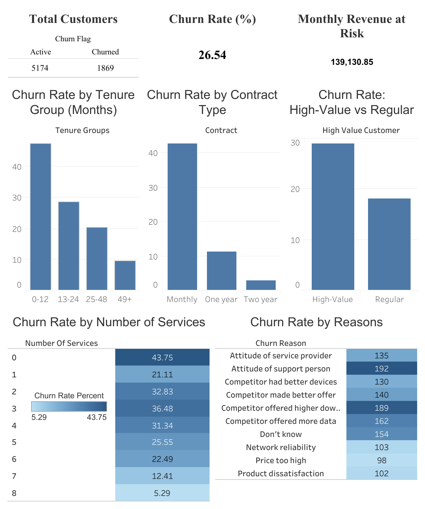

# Customer Churn Prediction & Retention Analysis – End-to-End Analytics & Machine Learning Project

## Overview

This project analyzes customer churn for a telecommunications company to identify churn drivers, quantify revenue at risk, and provide actionable retention insights. It was built as a **portfolio-ready, end-to-end data analytics project**, covering data cleaning in Python, KPI analysis in SQL, and interactive visualization in Tableau.

The goal is to demonstrate practical, real-world analytics skills aligned with junior to mid-level data analyst roles.

---

## Business Questions

The analysis answers the following key business questions:

* What is the overall customer churn rate?
* Which customer segments are most likely to churn based on tenure?
* How does contract type affect churn behavior?
* Are high-value customers more likely to churn than regular customers?
* How does the number of subscribed services impact churn likelihood?
* How much monthly revenue is at risk due to churn?
* What are the most common stated reasons for customer churn?

---

## Dataset

The dataset contains customer-level data from a telecommunications company. Each row represents a single customer and includes:

* Demographics (gender, senior citizen, location)
* Account details (tenure, contract type, payment method)
* Services subscribed (internet, streaming, security, support)
* Financial metrics (monthly charges, total charges, CLTV)
* Churn indicators (churn flag, churn score, churn reason)

---

## Tools & Technologies

* **Python (Pandas, NumPy, Scikit-learn)** – Data cleaning, feature engineering, and modeling
* **MySQL** – Data storage, KPI calculations, and SQL views
* **Tableau** – Interactive dashboard and data visualization
* **GitHub** – Version control and documentation

---

## Data Cleaning & Feature Engineering (Python)

Key preprocessing steps included:

* Handling missing values, especially in churn-related fields
* Standardizing column names (lowercase, underscores) for SQL compatibility
* Ensuring correct data types for numeric and categorical columns

## Engineered Features

* **Tenure Groups**: 0–12, 13–24, 25–48, 49+ months
* **Number of Services**: Total subscribed services per customer
* **High-Value Customer Flag**: Identifies customers with above-average value

These features enable meaningful customer segmentation and deeper churn analysis.

---

## SQL Analysis

Cleaned data was imported into MySQL using `LOAD DATA LOCAL INFILE`.

SQL views were created to support Tableau visualization and ensure consistent business logic:

* Overall churn rate
* Churn by tenure group
* Churn by contract type
* Churn by high-value customer status
* Monthly revenue at risk
* Churn by number of services
* Top churn reasons

---

## Tableau Dashboard

An interactive Tableau dashboard presents insights using a top-down analytical structure:

Dashboard → 

The dashboard is designed to be clear, minimal, and business-friendly, with filters for contract type, tenure group, and customer value.

---

## Key Insights

* Overall churn rate is approximately **26.5%**
* Customers with **0–12 months tenure** have the highest churn
* **Month-to-month contracts** churn significantly more than long-term contracts
* **High-value customers** show elevated churn risk, increasing revenue exposure
* Customers with fewer subscribed services are more likely to churn
* Pricing, competitive offers, and service quality are the most common churn reasons

---

## Business Recommendations

* Strengthen onboarding and early engagement for new customers
* Encourage long-term contracts through incentives
* Prioritize retention strategies for high-value customers
* Promote service bundling to increase customer stickiness
* Address pricing and service quality issues highlighted by churn reasons

---

## Machine Learning Extension

I expanded the project beyond data analytics and into predictive modeling in order to estimate the likelihood of customer churn and explore retention-focused machine learning workflows.

# ML Objectives

* Predict wether a customer is likely to churn
* Identify the strongest churn-driving factors
* Evaluate trade-offs precision and recall scores
* Explore business implications of different prediction strategies

# ML Workflow

* Feature engineering
* One-hot encoding categorical variables
* Train/test splitting
* Feature scaling
* Logistic Regression modeling
* Random Forest comparison
* Class imbalance handling using class_weight = 'balanced'
* Threshold tuning for recall optimization
* Confusion matrix and classification metric evaluation

# Key ML Findings

* Initial near-perfect accuracy revealed data leakage caused by churn-related fields (churn_score, churn_label, etc.)
* Logistic Regression outperformed Random Forest for churn recall in this dataset
* Lowering the prediction threshold significantly improved churn recall from 57% to 91%
* Recall was prioritized over accuracy due to the business impact of missed churn customers

# Final Model Performance

Balanced Logistic Regression with threshold tuning achieved:
* Recall: 91%
* Precision: 49%
* Accuracy: 71%
This configuration reduced missed churn customers substantially while increasing false positives, demonstrating the business trade-off between customer retention sensitivity and operational cost.

---

## Project Outcome

This project demonstrates a complete analytics and introductory machine learning workflow—from raw data preparation to business recommendations—using tools commonly required in data analytics roles. It reflects real-world challenges such as data cleaning decisions, SQL constraints, KPI design, dashboard storytelling, and predicitve modeling challenges.

---

## Repo Structure 

```
Customer-Churn-Prediction/
│
├── assets/
│   ├── churn_contract_pic.png
│   ├── churn_overview_pic.png
│   ├── churn_reason_pic.png
│   ├── churn_services_pic.png
│   ├── churn_tenure_pic.png
│   ├── churn_value_pic.png
│   ├── revenue_risk_churn_pic.png
│   └── telco_churn_dash.png
│
├── data/
│   ├── Telco_customer_churn.xlsx
│   └── churn_data_cleaned.csv
│   └── Telco Churn Data (ML).csv
│
├── python/
│   └── churn_data_cleaning.ipynb
│   └── Telco Churn ML.ipynb
│
├── report/
│   └── Telco churn project report (ML).pdf
│
├── sql/
│   └── telco_customer_churn_kpis.sql
│
├── tableau/
│   ├── Telco Churn Dashboard.pdf
│   └── Telco-Churn-Dashboard.twbx
│
└── README.md
```

---

## Deliverables

- **Tableau Dashboard**  
  - Interactive version (Tableau Public):  
    https://public.tableau.com/app/profile/ibrahim.gritly/viz/Telco-Churn-Dashboard/Dashboard1?publish=yes  
  - Dashboard file:  
    [Telco Churn Dashboard.pdf](tableau/Telco Churn Dashboard.pdf)

- **Python Analysis & Feature Engineering**  
  - Jupyter Notebook:  
    [churn_data_cleaning.ipynb](python/churn_data_cleaning.ipynb)

- **SQL Views & KPI Queries**  
  - SQL script:  
    [telco_customer_churn_kpis.sql](sql/telco_customer_churn_kpis.sql)

- **Cleaned Dataset**  
  - CSV file:  
    [churn_data_cleaned.csv](data/churn_data_cleaned.csv)

---

## Author

**Ibrahim M. Hassan**
Data Analytics Portfolio Project
